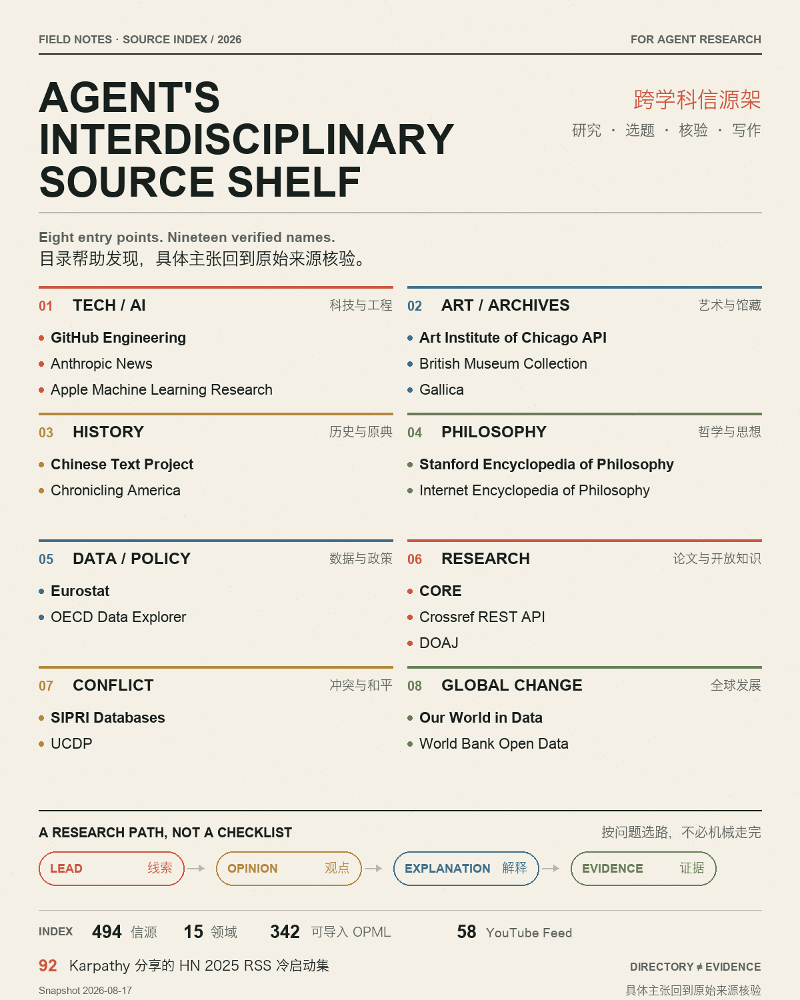

# Source Library Research Kit

A bilingual, machine-readable discovery index for research, topic selection, fact-checking, and source-backed writing.

The repository contains:

- **494 deduplicated sources** across **15 fields**;
- **342 OPML-importable entries**;
- **58 YouTube channel feeds**;
- the **92-item HN 2025 RSS starter set shared by Karpathy**;
- a reusable Matrix/Neo Skill that assigns sources one of five citation roles:
  **evidence → explanation → opinion → lead → inspiration**.

> This is a discovery index, not a facts database. Verify every publishable claim at the current original article, paper, dataset, official page, law, or judgment.



## Repository layout

```text
high-quality-source-library/
├── START_HERE_AGENT.md
├── PROMPT_FOR_AGENT_ZH.md
├── human_guide_zh.md
├── manifest.json
├── source_catalog.json
├── source_catalog.csv
├── source_library.xlsx
└── opml/
    ├── all_feeds.opml
    ├── core_feeds.opml
    ├── karpathy_hn2025_original.opml
    ├── mind_health_growth_business.opml
    └── youtube_channels.opml

skills/source-library-research/
└── SKILL.md
```

## Use with Matrix (`matrix.build`)

1. Download Matrix for macOS from [download.matrix.build](https://download.matrix.build).
2. Create or open a workspace around the research outcome you want.
3. Add this repository to that workspace as working material.
4. Ask your Lead to register the included `source-library-research` Skill for the workspace and keep `high-quality-source-library/` available beside it.
5. Describe the result you want, for example:

```text
Use the source library to build a claim–evidence–limit table for AI coding-agent reliability. Prioritize current primary evidence and verify every claim at the original source.
```

or:

```text
Use the included source-library-research Skill to find evidence and explanation sources for an X post about digital archives. Return a verified brief and current original links.
```

The Skill treats the catalog as a discovery index, selects sources by citation responsibility, and requires live verification before publication.

Matrix's public documentation does not currently define a stable manual custom-Skill installation path, GitHub-import button, or slash-command contract. Do not rely on guessed filesystem paths or commands; ask Neo to install or register the included Skill using the current in-product workflow.

Official Matrix references:

- [Matrix](https://matrix.build/)
- [Matrix guide](https://matrix.build/guide)
- [Matrix for macOS](https://download.matrix.build)

### Use the files in any agent workflow

Give your agent this instruction:

```text
Read high-quality-source-library/START_HERE_AGENT.md, manifest.json, source_catalog.json, and human_guide_zh.md. Filter the catalog for the topic, assign each selected source a citation role, then verify every publishable claim at its current original source. Do not cite a catalog row or RSS URL as evidence.
```

A ready-to-copy Chinese prompt is included at `high-quality-source-library/PROMPT_FOR_AGENT_ZH.md`.

## Query the catalog directly

```python
import json
from pathlib import Path

catalog = json.loads(
    Path("high-quality-source-library/source_catalog.json").read_text()
)

selected = [
    source
    for source in catalog
    if source["category"] == "数据与可视化"
    and source["citation_role"] in {"证据源", "解释源"}
    and source["priority"] in {"S", "A"}
]

for source in selected[:10]:
    print(source["name"], source["citation_role"], source["homepage"])
```

Useful fields include `category`, `subcategory`, `citation_role`, `priority`, `score`, `feed_status`, `x_use`, `why`, `verify_note`, and `validation_note`.

## OPML files

| File | Entries | Use |
|---|---:|---|
| `all_feeds.opml` | 342 | Full importable set |
| `core_feeds.opml` | 70 | Smaller high-priority starting set |
| `karpathy_hn2025_original.opml` | 92 | HN 2025 RSS starter set shared by Karpathy |
| `mind_health_growth_business.opml` | 97 | Psychology, health, growth, cognition, and business |
| `youtube_channels.opml` | 58 | YouTube channel feeds |

Import an OPML file into an RSS reader that supports OPML. Start with `core_feeds.opml`; importing everything on day one usually creates noise rather than a reading habit.

## Citation roles

1. **Evidence source** — original research, systematic reviews, official records, primary data, databases, laws, judgments, or first-party documentation.
2. **Explanation source** — expert institutions, researchers, or high-quality journalism explaining evidence.
3. **Opinion source** — a named author's interpretation; attribute it explicitly.
4. **Lead source** — discovery only; follow its links to the original material.
5. **Inspiration source** — structure, visual language, or creative reference; never factual proof.

A high score is reading priority, not proof of truth. `feed_status` records a network check made on the snapshot date; it does not prove factual accuracy, permanence, accessibility, or reuse rights.

## Karpathy 92: precise attribution

Use this meaning: **“Karpathy shared HN 2025 RSS starter set.”**

The OPML was created by emschwartz from Michael Lynch's 2025 Hacker News personal-blog ranking and shared by Karpathy. It does **not** mean Karpathy personally reviewed or endorsed every source.

Primary provenance:

- [Karpathy's X post](https://x.com/karpathy/status/2018043254986703167)
- [emschwartz's Gist](https://gist.github.com/emschwartz/e6d2bf860ccc367fe37ff953ba6de66b)
- [HN Popularity Contest methodology](https://popularity.refactoringenglish.com/about/)

## Snapshot

The bundled catalog is a snapshot dated **2026-08-17**. Current policies, prices, rankings, statistics, research progress, links, and feed status must be checked live.

## License

The repository's original curation, documentation, and Skill instructions are released under [CC BY 4.0](LICENSE).

The catalog describes and links to third-party sources. Their articles, feeds, trademarks, images, datasets, and other content remain subject to their respective owners' terms and licenses. Inclusion does not redistribute or relicense that content.
